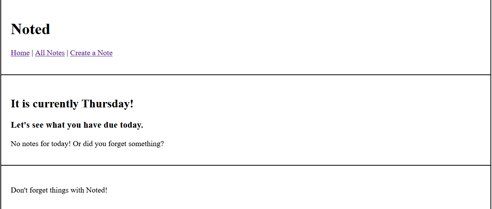
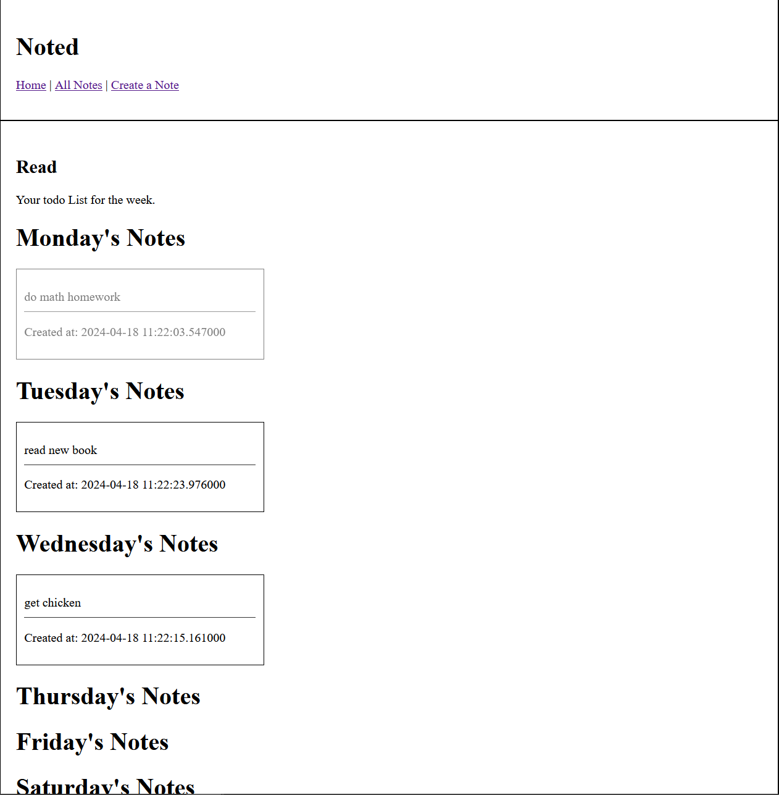
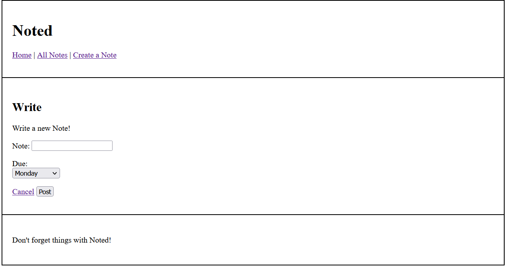

# Noted

## Description

Noted is an app that allows you to take notes on things you want to keep a mind on throughout the week. The app allows you to create notes, mark them as done, edit them, or delete the notes once you feel it no longer necessary to have it around (hovering over the notes reveal the edit, delete, and mark option).

## Deployment
Click [here](https://i6.cims.nyu.edu/~mqp9997/7-web-app-mathewpan2/flask.cgi) for the i6 link

## Collaborators
No collaborators

